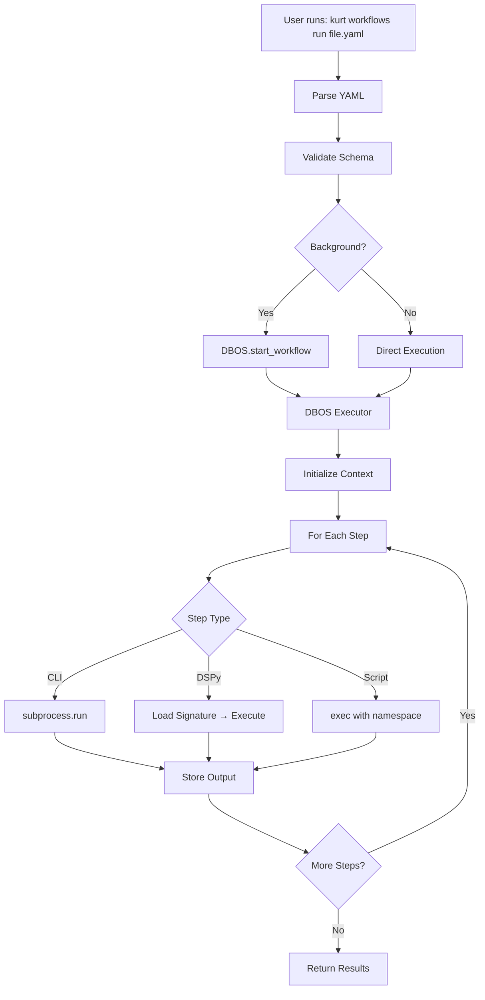

# Workflow System Architecture

## Overview

Kurt's workflow system provides a YAML-based declarative interface for defining multi-step content operations, built on top of DBOS for durability and state management.

## Design Philosophy

### Not Reinventing the Wheel

After researching existing workflow orchestration systems (Temporal, Prefect, Kestra, pypyr, Airflow), we made a conscious decision to **leverage existing battle-tested infrastructure** rather than build our own:

- **DBOS** handles: Durability, state management, resumability, transactions
- **YAML layer** provides: Declarative interface, readability, templates
- **CLI primitives** offer: Unix-style composability, reusability

### Architecture Layers

```
┌─────────────────────────────────────┐
│   YAML Workflow Definitions         │  ← User-facing declarative layer
│   (High-level, readable)            │
└─────────────────┬───────────────────┘
                  │
                  ↓
┌─────────────────────────────────────┐
│   Parser & Executor                 │  ← Translation layer
│   (Variable substitution, steps)    │
└─────────────────┬───────────────────┘
                  │
                  ↓
┌─────────────────────────────────────┐
│   DBOS Workflows                    │  ← Execution & durability layer
│   (@DBOS.workflow decorators)       │
└─────────────────┬───────────────────┘
                  │
                  ↓
┌─────────────────────────────────────┐
│   Database (SQLite/Postgres)        │  ← State persistence
│   (Workflow status, checkpoints)    │
└─────────────────────────────────────┘
```

## Core Components

### 1. YAML Schema ([schema.py](../src/kurt/workflows/schema.py))

**Pydantic models** defining workflow structure:
- `WorkflowDefinition`: Top-level workflow container
- `WorkflowStep`: Individual step (cli, dspy, script, parallel types)
- `ErrorHandling`: Retry/skip/fail/fallback strategies

**Step Types:**
- `cli`: Execute Kurt CLI commands
- `dspy`: Run DSPy signatures for AI operations
- `script`: Inline Python code (minimal, prefer CLI)
- `parallel`: Execute multiple steps concurrently

### 2. Parser ([parser.py](../src/kurt/workflows/parser.py))

**Responsibilities:**
- Load and validate YAML files
- Variable substitution: `${var}`, `${var.field}`, `${var[0]}`
- Type-preserving variable resolution

**Design Decision:** Keep parser simple - it's just YAML → Pydantic → variables.

### 3. Executor ([executor.py](../src/kurt/workflows/executor.py))

**Workflow Execution Engine:**
- Manages `WorkflowContext` (variables, outputs, state)
- Executes steps sequentially
- Handles conditions, errors, retries
- Delegates to DBOS for durability

**Step Execution:**
- CLI: `subprocess.run()` with Kurt commands
- DSPy: Load signature → execute → return result
- Script: `exec()` in sandboxed namespace

### 4. DBOS Integration ([runner.py](../src/kurt/workflows/runner.py))

**DBOS Workflow Wrapper:**
```python
@DBOS.workflow()
def run_yaml_workflow(workflow_file, variables):
    # Load YAML
    # Execute steps
    # DBOS handles durability automatically
```

**Key Features:**
- Automatic checkpointing after each step
- Resume from failure point
- Event publishing for progress tracking
- Background execution with workflow IDs

### 5. CLI Primitives ([workflows_helpers.py](../src/kurt/commands/workflows_helpers.py))

**5 Generic Operations** (Unix philosophy):

1. **`write`** - File output (JSON/YAML/text, templates)
2. **`read`** - File input (auto-detect format)
3. **`transform`** - Data manipulation (filter/map)
4. **`validate`** - Data validation (types, schemas)
5. **`foreach`** - Batch operations

**Why Generic?**
- ✅ Composable (chain like Unix pipes)
- ✅ Reusable (any use case)
- ✅ Maintainable (small surface area)
- ✅ Testable (isolated units)

## Workflow Execution Flow



## Comparison with Other Systems

### vs. Airflow
- **Kurt**: Lightweight, DBOS-backed, content-focused
- **Airflow**: Heavy, DAG-based, data engineering

### vs. Prefect
- **Kurt**: YAML + DBOS decorators
- **Prefect**: Python decorators only

### vs. Temporal
- **Kurt**: YAML abstraction over DBOS
- **Temporal**: Code-first, polyglot

### vs. pypyr
- **Kurt**: Content ops + AI (DSPy), DBOS durability
- **pypyr**: Generic automation, no built-in durability

### vs. Kestra
- **Kurt**: Python-native, Kurt CLI integration
- **Kestra**: Standalone platform, event-driven

## Design Decisions

### ✅ What We Do Well

1. **YAML for Declarations** - Human-readable, easy to share
2. **DBOS for Execution** - Battle-tested durability
3. **DSPy Integration** - AI-powered content operations
4. **Generic CLI Primitives** - Unix philosophy
5. **Templates** - Separate complex workflows from code

### 🚫 What We Avoid

1. **Custom Orchestration Logic** - Use DBOS instead
2. **Use-Case-Specific Commands** - Keep primitives generic
3. **Long Embedded Scripts** - Use CLI or templates
4. **Reinventing Scheduling** - Leverage DBOS/cron
5. **Heavy Dependencies** - Stay lightweight

## Future Considerations

### Potential Enhancements

1. **Parallel Execution** - True parallelism for `parallel` steps
2. **Conditional Workflows** - Complex branching logic
3. **Scheduled Workflows** - DBOS scheduled workflows
4. **Workflow Composition** - Call workflows from workflows
5. **Template Library** - Pre-built workflow templates

### Integration Opportunities

1. **pypyr-style** plugin system for custom steps
2. **Temporal integration** for polyglot workflows
3. **Kestra events** for trigger-based execution
4. **Prefect UI** for visualization

## Usage Patterns

### Simple Workflow
```yaml
name: "Basic Example"
steps:
  - name: "fetch"
    type: "cli"
    command: "content fetch"
    args:
      url: "https://example.com"
```

### Complex Workflow with AI
```yaml
name: "AEO Pipeline"
steps:
  - type: "cli"
    command: "integrations research reddit"
    output: "questions"

  - type: "dspy"
    signature: "AnalyzeQuestions"
    inputs:
      questions: "${questions}"
    output: "clusters"

  - type: "cli"
    command: "workflows write"
    args:
      data: "${clusters}"
      output: "results.json"
```

## Performance Characteristics

- **Startup**: ~100ms (YAML parsing + DBOS init)
- **Step Overhead**: ~50ms (DBOS checkpoint)
- **CLI Step**: ~100-500ms (subprocess + command)
- **DSPy Step**: Variable (depends on LLM call)
- **Background Mode**: Near-instant return with workflow ID

## Testing Strategy

1. **Unit Tests**: Parser, schema validation
2. **Integration Tests**: End-to-end workflow execution
3. **CLI Tests**: Each primitive command
4. **Template Tests**: Example workflows

## Conclusion

Kurt's workflow system is **deliberately simple**, leveraging proven technologies (DBOS, YAML, Unix primitives) rather than building complex custom orchestration. This approach provides:

- ✅ **Reliability** through DBOS
- ✅ **Usability** through YAML
- ✅ **Flexibility** through composable CLI primitives
- ✅ **Maintainability** through minimal custom code

The key insight: **orchestration is a solved problem**. We add value through content-specific operations (DSPy, Kurt CLI) not by rebuilding workflow engines.
